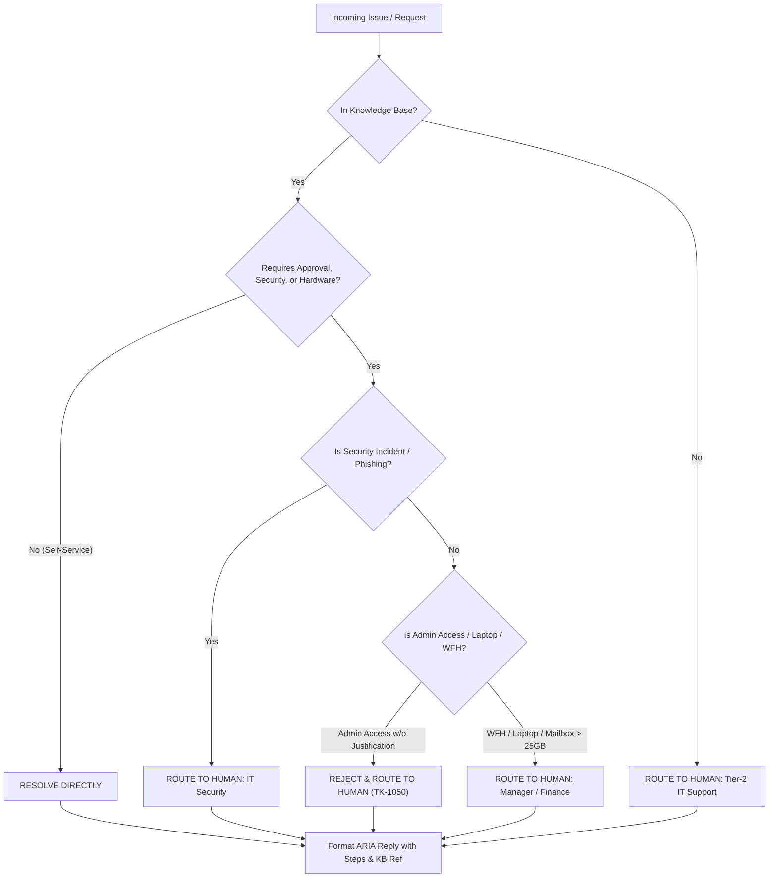

# ARIA — System Architecture & Decision Engine

**Veridian Corp — Automated Resolution & IT Assistant (ARIA)**

---

## 1. System Architecture Overview

The ARIA IT Support Agent is built on a decoupled, policy-grounded architecture separating the **User Experience (Next.js)**, **API Orchestration & Analytics (Flask)**, and **Cognitive AI Decision Engine (Google Gemini 2.5 Flash)**.

```text
                               ┌───────────────────────────┐
                               │   USER / IT ADMIN         │
                               └─────────────┬─────────────┘
                                             │
                                             ▼
                               ┌───────────────────────────┐
                               │ React / Next.js UI        │
                               │ (Port 3001)               │
                               └─────────────┬─────────────┘
                                             │  HTTP / REST
                                             ▼
                               ┌───────────────────────────┐
                               │ Flask API Gateway         │
                               │ (Port 5000)               │
                               └─────────────┬─────────────┘
                                             │
                                             ▼
                               ┌───────────────────────────┐
                               │ Google Gemini 2.5 Flash   │
                               └─────────────┬─────────────┘
                                             │
                      ┌──────────────────────┴──────────────────────┐
                      ▼                                             ▼
        ┌───────────────────────────┐                 ┌───────────────────────────┐
        │   Knowledge Base (KB)     │                 │   Ticket Queue & History  │
        │   Policies KB-01..10      │                 │   Precedents (e.g. TK-1050)│
        └─────────────┬─────────────┘                 └─────────────┬─────────────┘
                      │                                             │
                      └──────────────────────┬──────────────────────┘
                                             │
                                             ▼
                               ┌───────────────────────────┐
                               │      DECISION ENGINE      │
                               └─────────────┬─────────────┘
                                             │
                      ┌──────────────────────┴──────────────────────┐
                      ▼                                             ▼
        ┌───────────────────────────┐                 ┌───────────────────────────┐
        │    [RESOLVE DIRECTLY]     │                 │    [ROUTE TO HUMAN]       │
        │    Self-Service Portal    │                 │    Security / Manager /   │
        │    Password / Wi-Fi /     │                 │    Finance / Tier-2 IT    │
        │    Spooler / Archiving    │                 │                           │
        └─────────────┬─────────────┘                 └─────────────┬─────────────┘
                      │                                             │
                      └──────────────────────┬──────────────────────┘
                                             │
                                             ▼
                               ┌───────────────────────────┐
                               │       ARIA REPLY          │
                               │   Grounded & Formatted    │
                               └───────────────────────────┘
```

---

## 2. Decision Engine Workflow

Every incoming employee request or chat inquiry undergoes policy-grounded evaluation before taking action:



### Evaluation Criteria Matrix

| Scenario | Policy / Precedent | Action / Decision | Routing Target |
| :--- | :--- | :--- | :--- |
| **Password Lockout** | `KB-01` | `[RESOLVE DIRECTLY]` | Self-service SSO portal link |
| **Guest Wi-Fi Access** | `KB-02` | `[RESOLVE DIRECTLY]` | 24-hr kiosk instructions |
| **Laptop Replacement (≥4 yrs)** | `KB-03` / Asset Policy | `[RESOLVE DIRECTLY]` | IT Refresh Form |
| **Laptop Replacement (<4 yrs)** | `KB-03` / Asset Policy | `[ROUTE TO HUMAN]` | Manager / Finance Approval |
| **Phishing Attempt** | `KB-09` / Security Policy | `[ROUTE TO HUMAN]` | IT Security (`security@veridian-corp.example`) |
| **Admin Access Request** | `TK-1050` Precedent | `[ROUTE TO HUMAN]` | IT Security / Department Manager |
| **Non-Catalog Software** | `KB-05` | `[ROUTE TO HUMAN]` | IT Security Review (3–5 business days) |
| **Contractor VPN Access** | `KB-04` | `[ROUTE TO HUMAN]` | Manager Sign-off |

---

## 3. Data Flow & Component Architecture

### Backend Stack (`backend/`)
* **`app.py`**: REST API endpoints (`/api/requests`, `/api/tickets`, `/api/stats`, `/api/meta`, `/api/chat`, `/api/tickets/<id>/update`, `/api/requests/<id>/update`).
* **`knowledge_base.py`**: Stores knowledge base articles (`KB-01` through `KB-10`), employee requests queue (`REQ-01` to `REQ-15`), active tickets (`TK-1043` to `TK-1052`), and system prompt generator.

### Frontend Stack (`frontend-next/`)
* **`Shell.tsx`**: Main application shell with collapsible sidebar navigation and auto-refresh state updates.
* **`Dashboard.tsx`**: Real-time operational dashboard featuring active security alert banners, stat cards, priority breakdown charts, category metrics, and quick action modals.
* **`Requests.tsx`**: Employee requests grid with live priority indicators, status filtering, and one-click ARIA analysis.
* **`Tickets.tsx`**: Ticket queue table supporting review and status transitions (`Mark Resolved`, `Reject/Close`, `Re-open`).
* **`Chat.tsx`**: Interactive chat interface supporting dynamic session isolation per customer request and auto-filtering of active items.
* **`AnalysisModal.tsx`**: Deep-dive analysis modal executing live AI recommendations and state persistence.

---

## 4. Session & State Isolation Protocol

To ensure strict data boundaries across multiple user requests:
1. **Isolated Session IDs**: Selecting an employee request generates a unique session identifier (`session_<reqId>_<timestamp>`).
2. **Context Scope**: System prompts dynamically inject only the selected request context along with company policy rules.
3. **State Cleanup**: When an issue is resolved, its status updates in memory, excluding it from active security alert banners and chatbot context sidebars.

---

## 5. Security & Compliance Rules
1. **No Phishing Forwarding**: Phishing emails must **never** be forwarded. ARIA instructs users to isolate the email and reports directly to `security@veridian-corp.example`.
2. **Strict Admin Justification**: Admin rights requests without documented business justification are rejected per precedent `TK-1050`.
3. **Expense Tool Boundary**: Expense tool bugs (`KB-08`) are redirected to Finance; IT handles technical authentication issues only.
